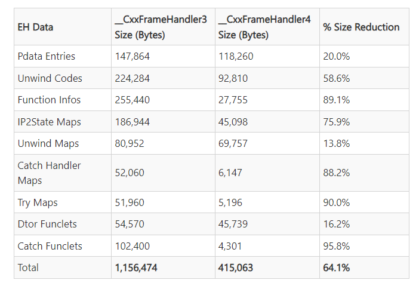
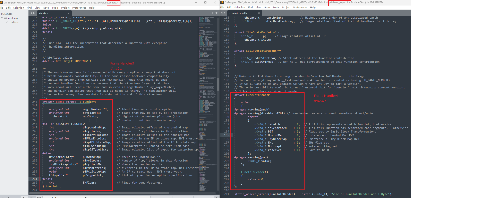

# Visual Studio C++ Exception compatibility

## Problem description
Only consider Visual Studio >= 2015 versions.

For a lower version of VS(say, vs2017), we link an library (say, `hello`) which is build with higher version of VS(say, vs2019). The library code consists of C++ exception. Then our current project that using lower version of VS, will get link error. Such as symbol `__CxxFrameHandler4` not resolved.

## Problem description (Chinese)
（只考虑 VS >= 2015 的版本）

低版本的VS， 链接了由高版本 VS 编译的库（例如叫hello），并且hello的代码中用到了 Exception。

那么链接会报错， 报告的符号和 `/GS` 以及 `/EHSC` 有关。注意， CMake 生成的 VS 工程， 编译选项(CMAKE_CXX_FLAGS)默认带有 `/GS`[^1] 和 `/EHsc`[^2].

## Reproduce Steps

Go to `hello` directory, run `build/vs2019-x64.cmd`

Go to `use_hello` directory, run `build/vs2017-x64.cmd`

## Error Output
```
hello.lib(hello.obj) : error LNK2001: 无法解析的外部符号 __CxxFrameHandler4 [D:\github\min-repros\test_GS_EHsc_link_error\use_he
llo\build\vs2017-x64\testbed.vcxproj]
D:\github\min-repros\test_GS_EHsc_link_error\use_hello\build\vs2017-x64\Debug\testbed.exe : fatal error LNK1120: 1 个无
法解
析的外部命令 [D:\github\min-repros\test_GS_EHsc_link_error\use_hello\build\vs2017-x64\testbed.vcxproj]
```

## Solution
按 [^3] 和 [^4] 给出的解决方法， 高版本VS编库时， 编译选项中添加 `/d2FH4- ` 或 `-d2FH4- ` 即可。

解释：
- `/d2FH4`: 开启 FH4
- `/d2FH4-`: 关闭 FH4， 会 Fallback 到 FH3 (Frame Handler 3)
- Prefixing can use `/` or `-` interchangeably with no difference.
- `FH4` 可以认为是 `__CxxFrameHandler4` 中的 Frame Handler 4 的缩写
- Visual Studio 2019 Preview 3 和之后的版本， 默认用的是 Frame Handler 4, 对应到 `__CxxFrameHandler4` 等符号
- Visual Studio 2019 Preview 3 之前的版本， 用的是 Frame Handler 3, 对应到 `__CxxFrameHandler3` 等符号
- FH4 的使用场合：目前只用于 x64, 以后可以扩展到 ARM32/ARM64 以及少量 x86.
> As mentioned in the title, FH4 is currently only enabled for x64 binaries. However, the techniques described are extensible to ARM32/ARM64 and to a lesser extent x86.
- MSVC 为啥要发明 `Frame Handler 4` 呢？ 因为可以缩小二进制文件大小



对应到代码层面，以 VS2022 内置的头文件为例，对比：
- `ehdata.h`: C:\Program Files\Microsoft Visual Studio\2022\Community\VC\Tools\MSVC\14.36.32532\include\ehdata.h
- `ehdata4_export.h`: C:\Program Files\Microsoft Visual Studio\2022\Community\VC\Tools\MSVC\14.36.32532\include

可以看到，Frame Handler 4 使用的结构体，使用了 union 来减小内存占用， 并且还是用了位域，进一步缩小占用。

## References
[^1]: [/GS (Buffer Security Check)](https://learn.microsoft.com/en-us/cpp/build/reference/gs-buffer-security-check?view=msvc-170)
[^2]: [/EH (Exception handling model)](https://learn.microsoft.com/en-us/cpp/build/reference/eh-exception-handling-model?view=msvc-170)
[^3]: [What is __CxxFrameHandler4 and what does linker error "unresolved external symbol __CxxFrameHandler4" mean, exactly?](https://stackoverflow.com/questions/65672356/what-is-cxxframehandler4-and-what-does-linker-error-unresolved-external-symbo)
[^4]: [Making C++ Exception Handling Smaller On x64](https://devblogs.microsoft.com/cppblog/making-cpp-exception-handling-smaller-x64/)
[^5]: [ICE VS2019 and VS2022, NOT on VS2017](https://developercommunity.visualstudio.com/t/ice-vs2019-and-vs2022-not-on-vs2017/1674778)