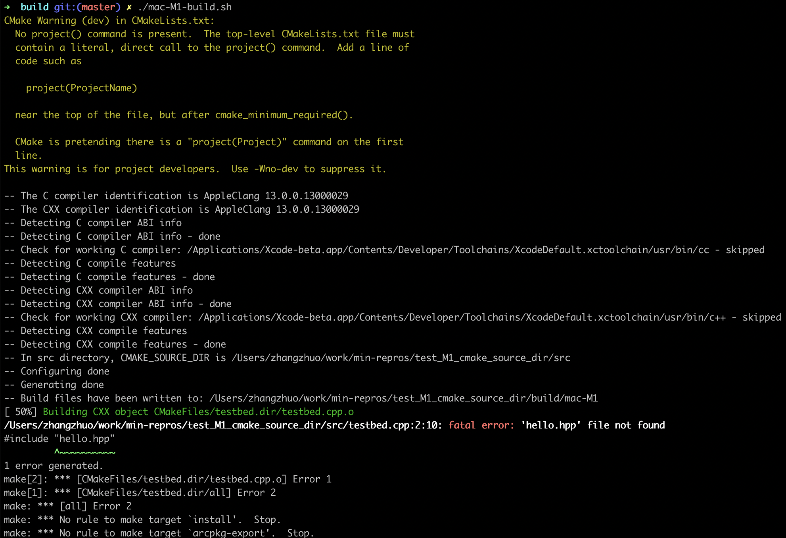

# test_M1_cmake_source_dir

## Intro
This directory serves as the minimal reproduce example for printing `CMAKE_SOURCE_DIR` in a subdirectory's CMakeLists.txt under Mac M1 platform.


## mac-M1 output
```bash
cd build
./mac-M1-build
```

The expected output is:
```
-- in src directory, cmake_source_dir is /users/zhangzhuo/work/min-repros/test_m1_cmake_source_dir
```

The actual output is:
```
-- in src directory, cmake_source_dir is /users/zhangzhuo/work/min-repros/test_m1_cmake_source_dir/src
```

