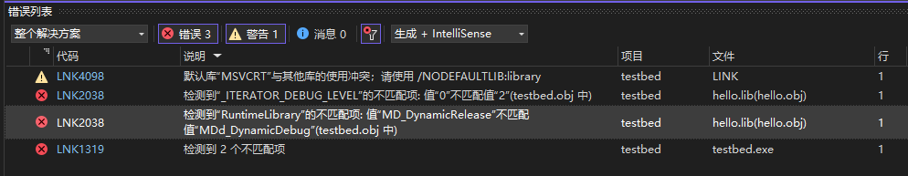
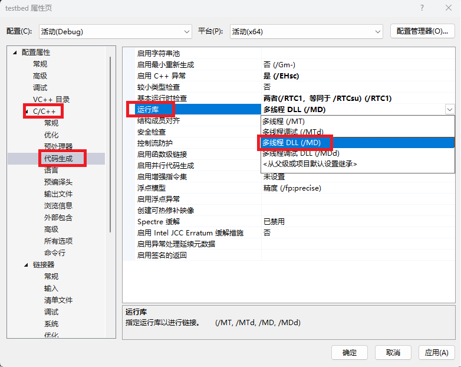

# Visual Studio Debug build type use Relase library

## Purpose
Gives the minimal reprodiable example, demonstrates that why and what condition causes Debug build type cann't use Release libraries (which causes link error).

### Minimal Reproduce
The linked library's API uses C++ containers, e.g. `std::string` in `hello.h` ([hello/hello.h](hello/hello.h)).

i.e.:
```cpp
void hello(std::string& name);  // This can reproduce the link errors in the next section
```

```cpp
void hello(const char* name);  // This cannot reproduce the link errors in the next section
```

## Error output


```bash
已启动生成...
1>------ 已启动生成: 项目: testbed, 配置: Debug x64 ------
1>hello.lib(hello.obj) : error LNK2038: 检测到“_ITERATOR_DEBUG_LEVEL”的不匹配项: 值“0”不匹配值“2”(testbed.obj 中)
1>hello.lib(hello.obj) : error LNK2038: 检测到“RuntimeLibrary”的不匹配项: 值“MD_DynamicRelease”不匹配值“MDd_DynamicDebug”(testbed.obj 中)
1>LINK : warning LNK4098: 默认库“MSVCRT”与其他库的使用冲突；请使用 /NODEFAULTLIB:library
1>D:\github\min-repros\test_VS_debug_build_type_use_release_library\use_hello\build\vs2022-x64\Debug\testbed.exe : fatal error LNK1319: 检测到 2 个不匹配项
1>已完成生成项目“testbed.vcxproj”的操作 - 失败。
========== 生成: 0 成功，1 失败，1 最新，0 已跳过 ==========
========= 生成 开始于 2:10 PM，并花费了 00.312 秒 ==========
```

Note: There are two link errors:

### 1. error LNK2038: `_ITERATOR_DEBUG_LEVEL` not matches.

According to reference[1], Default value of `_ITERATOR_DEBUG_LEVEL`:

| Build Type | Macro value |
| ---------- | ----------- |
| Debug      |  2          |
| Release    |  0          |

Thus we can know from the error message (if not changed default value of `_ITERATOR_DEBUG_LEVEL`):

> 检测到“_ITERATOR_DEBUG_LEVEL”的不匹配项: 值“0”不匹配值“2”

Current project's build type is Debug (`_ITERATOR_DEBUG_LEVEL=2`), but uses an Release library (`_ITERATOR_DEBUG_LEVEL=0`)

> 检测到“_ITERATOR_DEBUG_LEVEL”的不匹配项: 值“2”不匹配值“0”

Current project's build type is Release (`_ITERATOR_DEBUG_LEVEL=0`), but uses an Debug library (`_ITERATOR_DEBUG_LEVEL=2`)

### 2. error LNK2038: 检测到“RuntimeLibrary”的不匹配项: 值“MD_DynamicRelease”不匹配值“MDd_DynamicDebug”

`MD_DynamicRelease` is for Release build type.

`MDd_DynamicDebug` is for Debug build type.

### Solutions
1. Use same build type for current project, and the linked library (Recommended)

2. Switch current project's C Rumtime Library to `MD` from `MDd` (Not recommended)



## References
1. <https://learn.microsoft.com/en-us/cpp/standard-library/iterator-debug-level?view=msvc-170>