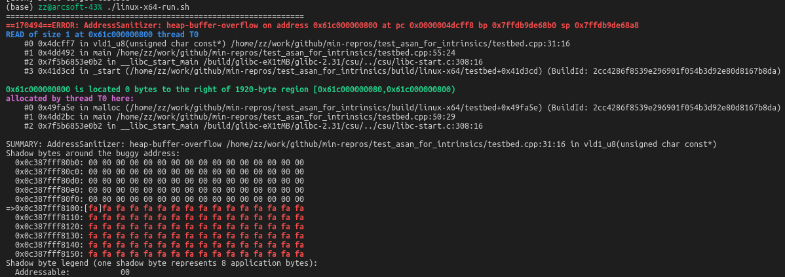
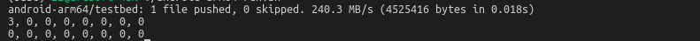

# test_asan_for_intrinsics

( Reported in https://github.com/android/ndk/issues/1687 )

When loading data from memory to NEON vector registers, can Address Sanitizer detect invalid memory read?

In this example, it invokes ARM NEON Intrinsics `vld1_u8` which will load from invalid memory.

To verify, a simulated `vld1_u8` is implemented for non-NEON case, such as Linux x64 compilation. The actual result:

| platform | ASan report invalid read ? |
| -------- | -------------------------- |
| arm32    | No |
| arm64    | No |
| linux-x64 | Yes |

## Execute Steps & Snapshots

### Target platform is Linux-x64
```bash
cd build
./linux-x64-build.sh
./linux-x64-run.sh
```



### Target platform is Android ARM
```bash
cd build
./android-arm64-build.sh
./android-arm64-run.sh
```

