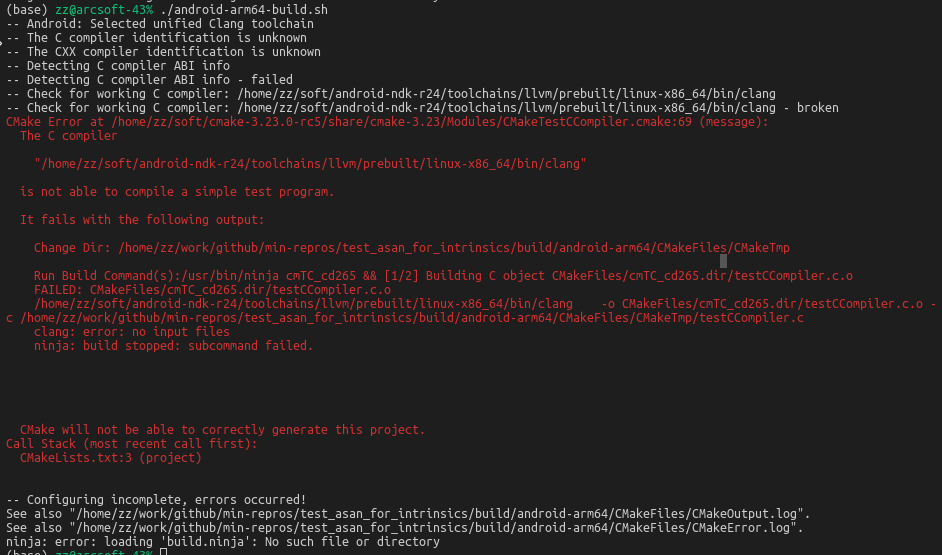

# ndk-r24 + CMake failed

## Intro
This folder serves as the minimal reproduce example for ndk+cmake build, shows ndk-r24 fail, and ndk-r23b success, ndk-r25-beta2 success.

## Environment
- Host: Ubuntu 20.04
- CMake version: cmake-3.23.0-rc5

| ndk version   | state   |
| ------------- | ------- |
| ndk-r23b      | success |
| ndk-r24       | fail    |
| ndk-r25-beta2 | success |

See build/android-arm64-build.sh for switching ndk versions.

## Output
```bash
cd build
./android-arm64-build.sh
```


```
-- Android: Selected unified Clang toolchain
-- The C compiler identification is unknown
-- The CXX compiler identification is unknown
-- Detecting C compiler ABI info
-- Detecting C compiler ABI info - failed
-- Check for working C compiler: /home/zz/soft/android-ndk-r24/toolchains/llvm/prebuilt/linux-x86_64/bin/clang
-- Check for working C compiler: /home/zz/soft/android-ndk-r24/toolchains/llvm/prebuilt/linux-x86_64/bin/clang - broken
CMake Error at /home/zz/soft/cmake-3.23.0-rc5/share/cmake-3.23/Modules/CMakeTestCCompiler.cmake:69 (message):
  The C compiler

    "/home/zz/soft/android-ndk-r24/toolchains/llvm/prebuilt/linux-x86_64/bin/clang"

  is not able to compile a simple test program.

  It fails with the following output:

    Change Dir: /home/zz/work/github/min-repros/test_cmake_ndk/build/android-arm64/CMakeFiles/CMakeTmp

    Run Build Command(s):/usr/bin/ninja cmTC_7739e && [1/2] Building C object CMakeFiles/cmTC_7739e.dir/testCCompiler.c.o
    FAILED: CMakeFiles/cmTC_7739e.dir/testCCompiler.c.o
    /home/zz/soft/android-ndk-r24/toolchains/llvm/prebuilt/linux-x86_64/bin/clang    -o CMakeFiles/cmTC_7739e.dir/testCCompiler.c.o -c /home/zz/work/github/min-repros/test_cmake_ndk/build/android-arm64/CMakeFiles/CMakeTmp/testCCompiler.c
    clang: error: no input files
    ninja: build stopped: subcommand failed.


  CMake will not be able to correctly generate this project.
Call Stack (most recent call first):
  CMakeLists.txt:3 (project)


-- Configuring incomplete, errors occurred!
See also "/home/zz/work/github/min-repros/test_cmake_ndk/build/android-arm64/CMakeFiles/CMakeOutput.log".
See also "/home/zz/work/github/min-repros/test_cmake_ndk/build/android-arm64/CMakeFiles/CMakeError.log".
ninja: error: loading 'build.ninja': No such file or directory

```
