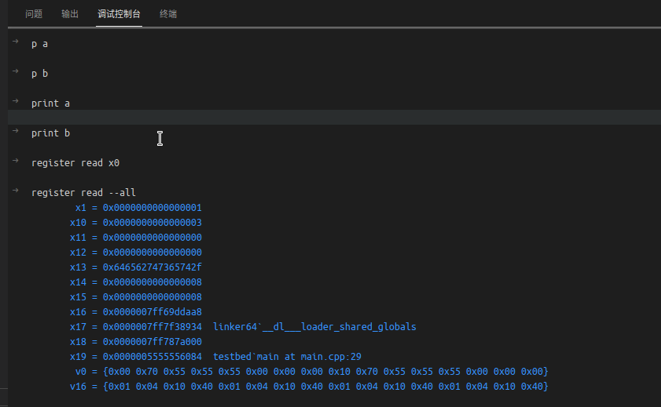
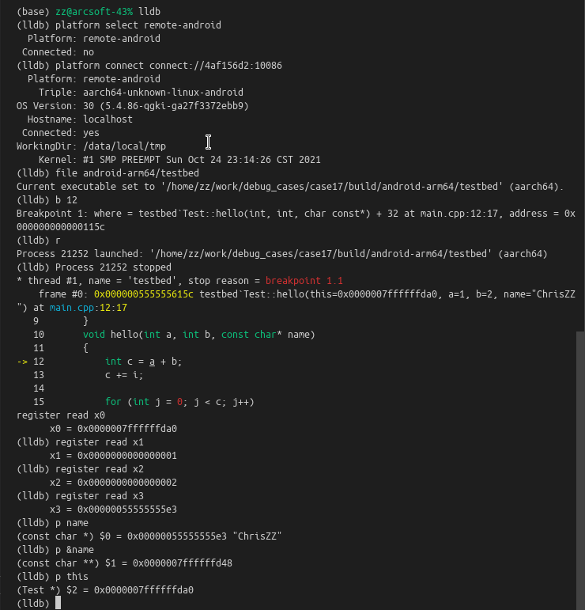

# test codelldb remote debug arm64 read register
For https://github.com/vadimcn/vscode-lldb/issues/708

Current solution: in VSCode setting.json, let codelldb using new version lldb (manually built):
(I use c2a8a104ec320c8bed39c3632eae2fb37f53487b)
```bash
    "lldb.library": "/home/zz/soft/llvm15-dev/lib/liblldb.so",
    "lldb.adapterEnv": {
        "LLDB_DEBUGSERVER_PATH": "/home/zz/soft/llvm15-dev/bin/lldb-server"
    },
```

## VSCode CodeLLDB remote debug output


As shown above, the command `register read x0` is not working.

## LLDB remote debug output
This is the original LLDB command remote debug output, i.e. the expected output:

