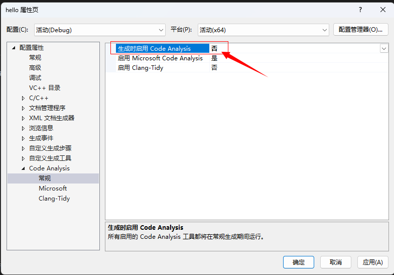
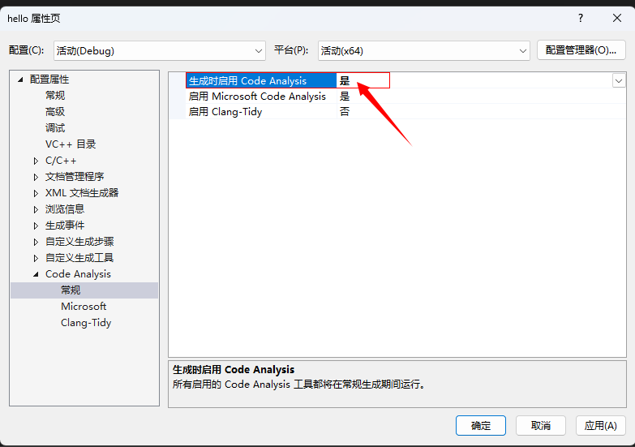
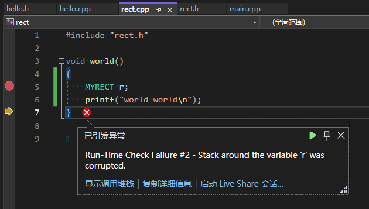

# Corrupted Stack by ODRV Example

ODR: One Definition Rule
ODRV: One Definition Rule Violation

This example contains two `MYRECT` classes, lives in different Translation Unit, and their `sizeof()` differs.

The constructor `MYRECT::MYRECT()` is actually **weak symbol**, the linker may pick any one of them. And the mangled names (symbol names) are same.

## Reproduce Steps
Currently only tested with VS2022.

Without ASan.

Default VS project in Debug mode, which enabled `/RTC1` (run time check).

```bash
cmake -S . -B build -G "Visual Studio 17 2022" -A x64
```

Sometimes this project can reproduce, sometimes not, it might be the Visual Studio's linker use full path, timestamp, etc. Then you may try the following trick:

Manually open each project's property page, enable Code Analysis on Build:


Then build each build, then disable each project's Code Analysis(Note: we have to do the enable-disable, otherwise Visual Studio cannot reproduce):


## Debug Output


## Explanation
The function `world()` use `MYRECT`, whose definition should be the 5-member one:
```cpp
// rect.h
struct MYRECT
{
    float x;
    float y;
    float width;
    float height;
    float angle;
    MYRECT()
    {
        printf("hello's MYRECT\n");
    }
    MYRECT(float x, float y, float width, float height, float angle) : x(x), y(y), width(width), height(height), angle(angle) {}
};
```

However, the debugger show us that it uses the 6-member one:
```cpp
// hello.cpp
struct MYRECT
{
    float left;
    float top;
    float right;
    float down;
    float cx;
    float cy;
    MYRECT()
    {
        left = 0, right = 0, top = 0, down = 0, cx = 0, cy = 0;
        printf("rect.h's MYRECT\n");
    }
    MYRECT(float left, float top, float right, float down) : left(left), top(top), right(right), down(down) { cx = (left + right) / 2; cy = (top + down) / 2; }
};
```

The hello.cpp's `MYRECT` is with `sizeof(MYRECT)=6*sizeof(float)`, whisch is greater than rect.h's `sizeof(MYRECT)=5*sizeof(float)`, thus the callstack is corrupted.

## Solution
1. Use namespace for each class / struct / enum / function definition, especially they are in `.h` files.
2. Use `unnamed namespace` (anonymous namespace) in `.cpp` files for internal linkage, just like `static`. (https://google.github.io/styleguide/cppguide.html#Internal_Linkage)

## Release Output
(Tested in Linux-x64) In release mode, cannot reproduce. It gives:

```bash
hello, (null)
MYRECT::MYRECT() in /home/zz/work/min-repros/test_corrupted_stack_by_ODRV/hello.cpp
MYRECT::MYRECT() in /home/zz/work/min-repros/test_corrupted_stack_by_ODRV/rect.h
world world
```

Which differs from Debug output:
```bash
hello, (null)
MYRECT::MYRECT() in /home/zz/work/min-repros/test_corrupted_stack_by_ODRV/hello.cpp
MYRECT::MYRECT() in /home/zz/work/min-repros/test_corrupted_stack_by_ODRV/hello.cpp
world world
```

## Terms
### Internal linkage v.s. External linkage
https://stackoverflow.com/a/1358622/2999096

> When you write an implementation file (.cpp, .cxx, etc) your compiler generates a translation unit. This is the source > file from your implementation plus all the headers you #included in it.
> 
> Internal linkage refers to everything only in scope of a translation unit.
> 
> External linkage refers to things that exist beyond a particular translation unit. In other words, accessible through > the whole program, which is the combination of all translation units (or object files).

Internal linkage 意思是只在当前翻译单元（TU）内有效的东西， 其他 TU 不会访问到。

### Internal linkage v.s. Weak symbols
https://stackoverflow.com/a/1358622/2999096


## Experiments
1. both without namespace
```
hello.cpp.o: 0000000000000000 W _ZN6MYRECTC2Ev
rect.cpp.o:  0000000000000000 W _ZN6MYRECTC2Ev
```
`W` means **weak symbol**:
> The symbol is a weak symbol that has not been specifically tagged as a weak object symbol.

2. both using `unnamed namespace`
```
hello.cpp.o: 0000000000000170 t _ZN12_GLOBAL__N_16MYRECTC2Ev
rect.cpp.o:  0000000000000160 t _ZN12_GLOBAL__N_16MYRECTC2Ev
```
`t` means:
> The symbol is in the text (code) section.

3. both using namespace, using different namespace:
```
hello.cpp.o: 0000000000000000 W _ZN2hh6MYRECTC2Ev
rect.cpp.o:  0000000000000000 W _ZN4rect6MYRECTC2Ev
```
Got weak symbols (`W`).

## Referenecs
- <https://stackoverflow.com/questions/10671956/same-class-name-in-different-c-files>