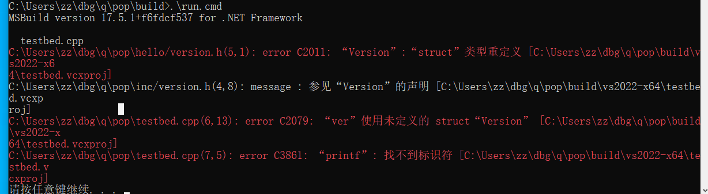

# MSVC error C2011 struct type redefinition example

## Intro
This example is taken and minimized from an actual C++ project. It demonstrates two same-name file `version.h` with nearly exactly same content causes type redefinition error.



## Build steps
```bash
cd build
.\vs2022-x64.cmd
run
```

## Analysis
There should be only one `version.h`. Small C++ project keep all files in one directory, where mid-level C++ projects separate .h and .cpp files in different directories. Here comes the problem: when people importing and C++ dependency, say, 'hello library', how should this client project put 'hello' library's header files?

Some people may just copy hello library's `version.h` to this client project's `inc` directory, and change that header guard. Then, the client project will get compile error.

Explanation: MSVC error C2011 "Version" : "struct" 类型重定义 means:
- Level1: physically, there is `hello/version.h` and `inc/version.h`
- Level2: logically, each `version.h` is thought to be only included once
- Level3: logically, the client `testbed.cpp` thought there is only one `Version` struct defined
- Level4: physically, during compile time, two `Version` struct is expanded from two `version.h` file

We may also analyze in another direction: from the error to the root cause:
- Error C2011 is compile error, means physically two `Version` struct definition found
- The most possible reason is `version.h` lacks header guard, but we found header guard there
- What is the same effect of "missing header guard"? Two files provides same name struct `Version`
- Using `find` with `grep` may find two files, or jusing using VSCode; Visual Studio sometimes just suck since we didn't explicitly put .h files as part of CMake targets

## Conclusion
Make it minimal as possible: only one `version.h` required, delete the other.
