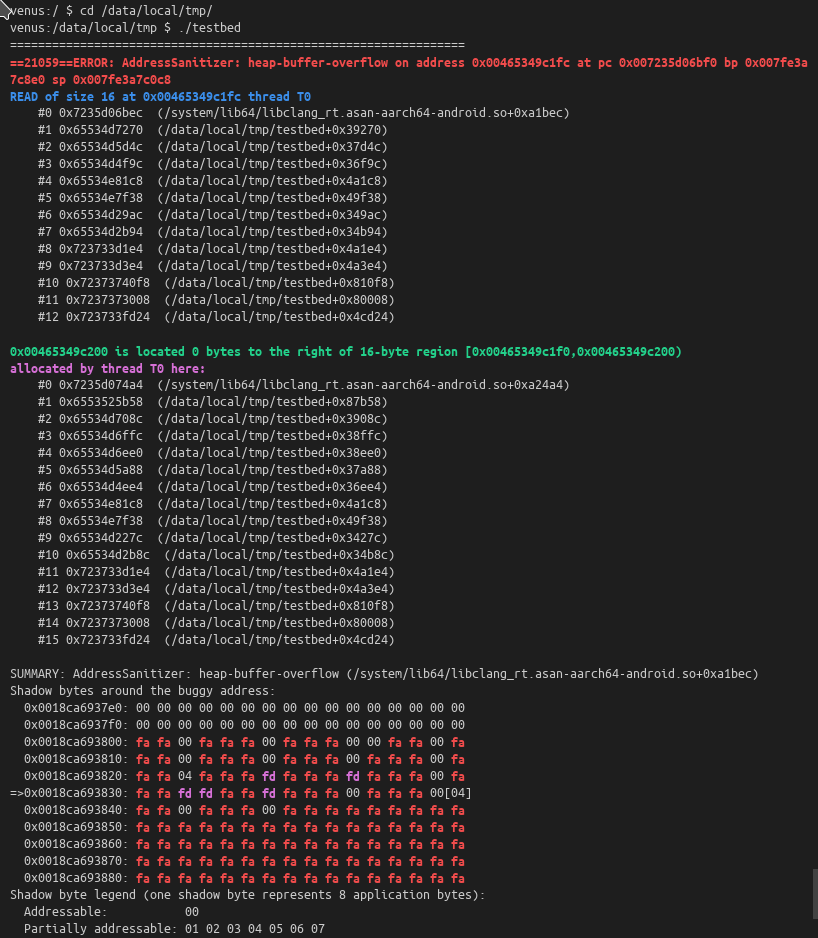

## Introduction
For the bug was originally reported in googletest issue: https://github.com/google/googletest/issues/3808

## Description
I write a simple unit test, with Address Sanitizer enabled. Compiled and run on different platform and compiler combination cases, get "heap-buffer-overflow" report on some, other no report:

| Target Platform | Compiler Toolchain | ASan report on Debug Type? | ASan report on Release Type? |
| --------------- | ------------------ | -------------------------- | ---------------------------- |
| Android         | ndk-r25-beta2      |  Y                         | N                            |
| Android         | ndk-r24-beta2      |  Y                         | N                            |
| Android         | ndk-r23b           |  Y                         | Y                            |
| Android         | ndk-r21e           |  Y                         | Y                            |
| Linux x64       | clang 14.0.1       |  N                         | N                            |

## Environment

- googletest: b53547bf01ee6d5c547bc539a498c49bc6027169
- android-ndk: [r25-beta2, r24-beta2, r23b, r21e]
- platform:
    - host: ubuntu 20.04 x86-64
    - device: XiaoMi 11

Code:([testbed.cpp](testbed.cpp))
```c++
#include "gtest/gtest.h"

void foo(const std::vector<std::vector<int>>& mat)
{
    std::vector<int> ofs;
    int i, j;
    for (i = 0; i < mat.size(); i++)
        for (j = 0; j < mat[i].size(); j++)
            ofs.push_back(i + j);
}

TEST(Imgproc_Sobel, t1){}
TEST(Imgproc_Sobel, t2){}
TEST(Imgproc_Sobel, t3){}
TEST(Imgproc_Sobel, t4){}
TEST(Imgproc_Sobel, t5){}

```

## Android Output
### Build
```bash
cd build
./android-arm64-build.sh
./android-arm64-run.sh
```

### Output



```
134|venus:/data/local/tmp $ ./testbed
=================================================================
==30946==ERROR: AddressSanitizer: heap-buffer-overflow on address 0x005e7af4e1fc at pc 0x007d7b7f7bf0 bp 0x007fd45f7280 sp 0x007fd45f6a68
READ of size 16 at 0x005e7af4e1fc thread T0
    #0 0x7d7b7f7bec  (/system/lib64/libclang_rt.asan-aarch64-android.so+0xa1bec)
    #1 0x59f6ca6dd8  (/data/local/tmp/testbed+0x38dd8)
    #2 0x59f6ca58f4  (/data/local/tmp/testbed+0x378f4)
    #3 0x59f6ca4b5c  (/data/local/tmp/testbed+0x36b5c)
    #4 0x59f6cb7cb4  (/data/local/tmp/testbed+0x49cb4)
    #5 0x59f6cb7a24  (/data/local/tmp/testbed+0x49a24)
    #6 0x59f6ca2598  (/data/local/tmp/testbed+0x34598)
    #7 0x59f6ca27ac  (/data/local/tmp/testbed+0x347ac)
    #8 0x7d7cdcd1e4  (/data/local/tmp/testbed+0x4a1e4)
    #9 0x7d7cdcd3e4  (/data/local/tmp/testbed+0x4a3e4)
    #10 0x7d7ce040f8  (/data/local/tmp/testbed+0x810f8)
    #11 0x7d7ce03008  (/data/local/tmp/testbed+0x80008)
    #12 0x7d7cdcfd24  (/data/local/tmp/testbed+0x4cd24)

0x005e7af4e200 is located 0 bytes to the right of 16-byte region [0x005e7af4e1f0,0x005e7af4e200)
allocated by thread T0 here:
    #0 0x7d7b7f84a4  (/system/lib64/libclang_rt.asan-aarch64-android.so+0xa24a4)
    #1 0x59f6cf4858  (/data/local/tmp/testbed+0x86858)
    #2 0x59f6ca6c08  (/data/local/tmp/testbed+0x38c08)
    #3 0x59f6ca6b80  (/data/local/tmp/testbed+0x38b80)
    #4 0x59f6ca6a6c  (/data/local/tmp/testbed+0x38a6c)
    #5 0x59f6ca5638  (/data/local/tmp/testbed+0x37638)
    #6 0x59f6ca4aa4  (/data/local/tmp/testbed+0x36aa4)
    #7 0x59f6cb7cb4  (/data/local/tmp/testbed+0x49cb4)
    #8 0x59f6cb7a24  (/data/local/tmp/testbed+0x49a24)
    #9 0x59f6ca1df0  (/data/local/tmp/testbed+0x33df0)
    #10 0x59f6ca27a4  (/data/local/tmp/testbed+0x347a4)
    #11 0x7d7cdcd1e4  (/data/local/tmp/testbed+0x4a1e4)
    #12 0x7d7cdcd3e4  (/data/local/tmp/testbed+0x4a3e4)
    #13 0x7d7ce040f8  (/data/local/tmp/testbed+0x810f8)
    #14 0x7d7ce03008  (/data/local/tmp/testbed+0x80008)
    #15 0x7d7cdcfd24  (/data/local/tmp/testbed+0x4cd24)

SUMMARY: AddressSanitizer: heap-buffer-overflow (/system/lib64/libclang_rt.asan-aarch64-android.so+0xa1bec) 
Shadow bytes around the buggy address:
  0x001bcf5e9be0: 00 00 00 00 00 00 00 00 00 00 00 00 00 00 00 00
  0x001bcf5e9bf0: 00 00 00 00 00 00 00 00 00 00 00 00 00 00 00 00
  0x001bcf5e9c00: fa fa 00 fa fa fa 00 fa fa fa 00 00 fa fa 00 fa
  0x001bcf5e9c10: fa fa 00 fa fa fa 00 fa fa fa 00 fa fa fa 00 fa
  0x001bcf5e9c20: fa fa 04 fa fa fa fd fa fa fa fd fa fa fa 00 fa
=>0x001bcf5e9c30: fa fa fd fd fa fa fd fa fa fa 00 fa fa fa 00[04]
  0x001bcf5e9c40: fa fa 00 fa fa fa 00 fa fa fa fa fa fa fa fa fa
  0x001bcf5e9c50: fa fa fa fa fa fa fa fa fa fa fa fa fa fa fa fa
  0x001bcf5e9c60: fa fa fa fa fa fa fa fa fa fa fa fa fa fa fa fa
  0x001bcf5e9c70: fa fa fa fa fa fa fa fa fa fa fa fa fa fa fa fa
  0x001bcf5e9c80: fa fa fa fa fa fa fa fa fa fa fa fa fa fa fa fa
Shadow byte legend (one shadow byte represents 8 application bytes):
  Addressable:           00
  Partially addressable: 01 02 03 04 05 06 07 
  Heap left redzone:       fa
  Freed heap region:       fd
  Stack left redzone:      f1
  Stack mid redzone:       f2
  Stack right redzone:     f3
  Stack after return:      f5
  Stack use after scope:   f8
  Global redzone:          f9
  Global init order:       f6
  Poisoned by user:        f7
  Container overflow:      fc
  Array cookie:            ac
  Intra object redzone:    bb
  ASan internal:           fe
  Left alloca redzone:     ca
  Right alloca redzone:    cb
  Shadow gap:              cc
==30946==ABORTING
Aborted 
```

## Linux x64 Output
### Build
```bash
cd build
./linux-x64-build.sh
./linux-x64-run.sh
```

### Output
