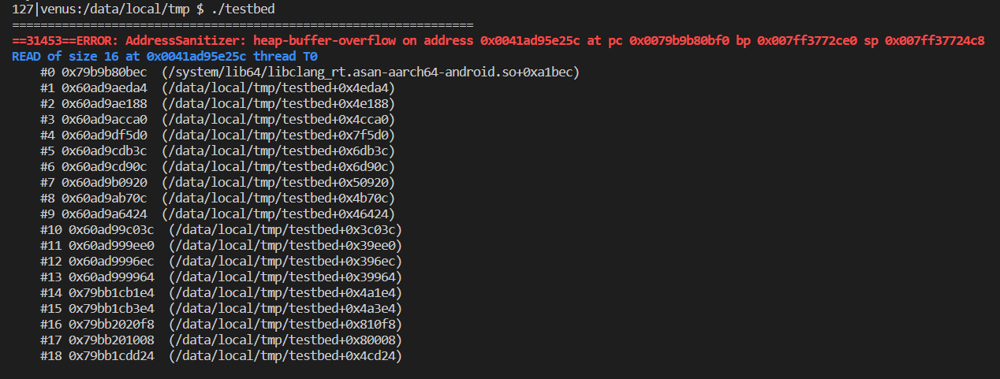
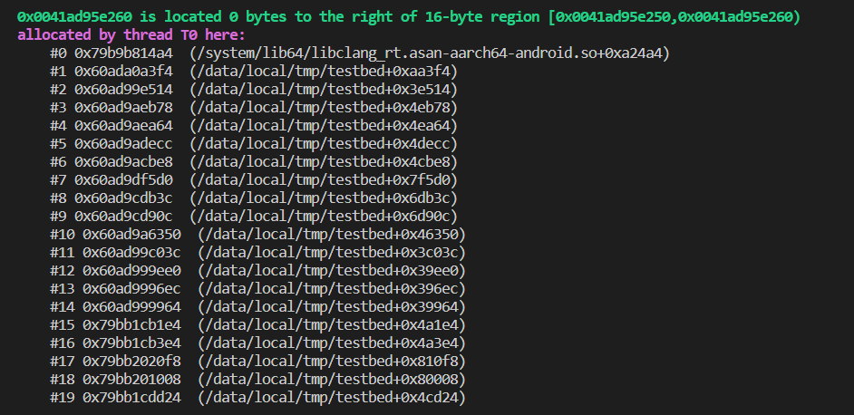
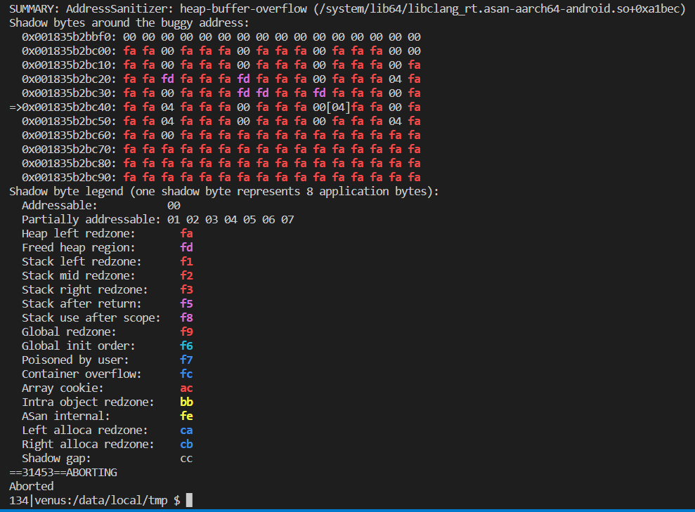

# test_gtest_typed_test_on_android_ndk

## TL;DR
Reported in https://github.com/google/googletest/issues/4019

Related: 
  - https://github.com/google/googletest/issues/2849
  - https://github.com/google/sanitizers/issues/1251

Solution: 
   `ASAN_OPTIONS=detect_container_overflow=0  ./testbed`

## Intro
This folder demonstrates an "bug"(I thought it should be), related to gtest and Android NDK.

The minimal reproducible code in in testbed.cpp in this folder.

The building and running environment is the combination of the following:
- build with android ndk-r21e / ndk-r23c
- turn on Address Sanitizer
- build with dependency library googletest, of the latest version
    ```
    63907e1b 2022-09-21 | Merge pull request #4011 from softwaregravy:patch-1 (HEAD -> main, origin/main) [Copybara-Service]
    ```
- running on an Android device, say, my device is XiaoMi 11
- install cmake, ninja (I'm on Ubuntu 20.04, but it should be OK on other OS, I guess)

## Build steps
I assume the required environment is installed already.

```bash
cd build
./android-arm64-build.sh
./android-arm64-run.sh
```

The running result:




```
android-arm64/testbed: 1 file pushed, 0 skipped. 270.8 MB/s (9637512 bytes in 0.034s)
=================================================================
==31431==ERROR: AddressSanitizer: heap-buffer-overflow on address 0x00401603325c at pc 0x0073a9ac9bf0 bp 0x007ff445c9a0 sp 0x007ff445c188
READ of size 16 at 0x00401603325c thread T0
    #0 0x73a9ac9bec  (/system/lib64/libclang_rt.asan-aarch64-android.so+0xa1bec)
    #1 0x5f16083da4  (/data/local/tmp/testbed+0x4eda4)
    #2 0x5f16083188  (/data/local/tmp/testbed+0x4e188)
    #3 0x5f16081ca0  (/data/local/tmp/testbed+0x4cca0)
    #4 0x5f160b45d0  (/data/local/tmp/testbed+0x7f5d0)
    #5 0x5f160a2b3c  (/data/local/tmp/testbed+0x6db3c)
    #6 0x5f160a290c  (/data/local/tmp/testbed+0x6d90c)
    #7 0x5f16085920  (/data/local/tmp/testbed+0x50920)
    #8 0x5f1608070c  (/data/local/tmp/testbed+0x4b70c)
    #9 0x5f1607b424  (/data/local/tmp/testbed+0x46424)
    #10 0x5f1607103c  (/data/local/tmp/testbed+0x3c03c)
    #11 0x5f1606eee0  (/data/local/tmp/testbed+0x39ee0)
    #12 0x5f1606e6ec  (/data/local/tmp/testbed+0x396ec)
    #13 0x5f1606e964  (/data/local/tmp/testbed+0x39964)
    #14 0x73ab4ba1e4  (/data/local/tmp/testbed+0x4a1e4)
    #15 0x73ab4ba3e4  (/data/local/tmp/testbed+0x4a3e4)
    #16 0x73ab4f10f8  (/data/local/tmp/testbed+0x810f8)
    #17 0x73ab4f0008  (/data/local/tmp/testbed+0x80008)
    #18 0x73ab4bcd24  (/data/local/tmp/testbed+0x4cd24)

0x004016033260 is located 0 bytes to the right of 16-byte region [0x004016033250,0x004016033260)
allocated by thread T0 here:
    #0 0x73a9aca4a4  (/system/lib64/libclang_rt.asan-aarch64-android.so+0xa24a4)
    #1 0x5f160df3f4  (/data/local/tmp/testbed+0xaa3f4)
    #2 0x5f16073514  (/data/local/tmp/testbed+0x3e514)
    #3 0x5f16083b78  (/data/local/tmp/testbed+0x4eb78)
    #4 0x5f16083a64  (/data/local/tmp/testbed+0x4ea64)
    #5 0x5f16082ecc  (/data/local/tmp/testbed+0x4decc)
    #6 0x5f16081be8  (/data/local/tmp/testbed+0x4cbe8)
    #7 0x5f160b45d0  (/data/local/tmp/testbed+0x7f5d0)
    #8 0x5f160a2b3c  (/data/local/tmp/testbed+0x6db3c)
    #9 0x5f160a290c  (/data/local/tmp/testbed+0x6d90c)
    #10 0x5f1607b350  (/data/local/tmp/testbed+0x46350)
    #11 0x5f1607103c  (/data/local/tmp/testbed+0x3c03c)
    #12 0x5f1606eee0  (/data/local/tmp/testbed+0x39ee0)
    #13 0x5f1606e6ec  (/data/local/tmp/testbed+0x396ec)
    #14 0x5f1606e964  (/data/local/tmp/testbed+0x39964)
    #15 0x73ab4ba1e4  (/data/local/tmp/testbed+0x4a1e4)
    #16 0x73ab4ba3e4  (/data/local/tmp/testbed+0x4a3e4)
    #17 0x73ab4f10f8  (/data/local/tmp/testbed+0x810f8)
    #18 0x73ab4f0008  (/data/local/tmp/testbed+0x80008)
    #19 0x73ab4bcd24  (/data/local/tmp/testbed+0x4cd24)

SUMMARY: AddressSanitizer: heap-buffer-overflow (/system/lib64/libclang_rt.asan-aarch64-android.so+0xa1bec) 
Shadow bytes around the buggy address:
  0x001802c065f0: 00 00 00 00 00 00 00 00 00 00 00 00 00 00 00 00
  0x001802c06600: fa fa 00 fa fa fa 00 fa fa fa 00 fa fa fa 00 00
  0x001802c06610: fa fa 00 fa fa fa 00 fa fa fa 00 fa fa fa 00 fa
  0x001802c06620: fa fa fd fa fa fa fd fa fa fa 00 fa fa fa 04 fa
  0x001802c06630: fa fa 00 fa fa fa fd fd fa fa fd fa fa fa 00 fa
=>0x001802c06640: fa fa 04 fa fa fa 00 fa fa fa 00[04]fa fa 00 fa
  0x001802c06650: fa fa 04 fa fa fa 00 fa fa fa 00 fa fa fa 04 fa
  0x001802c06660: fa fa 00 fa fa fa fa fa fa fa fa fa fa fa fa fa
  0x001802c06670: fa fa fa fa fa fa fa fa fa fa fa fa fa fa fa fa
  0x001802c06680: fa fa fa fa fa fa fa fa fa fa fa fa fa fa fa fa
  0x001802c06690: fa fa fa fa fa fa fa fa fa fa fa fa fa fa fa fa
Shadow byte legend (one shadow byte represents 8 application bytes):
  Addressable:           00
  Partially addressable: 01 02 03 04 05 06 07 
  Heap left redzone:       fa
  Freed heap region:       fd
  Stack left redzone:      f1
  Stack mid redzone:       f2
  Stack right redzone:     f3
  Stack after return:      f5
  Stack use after scope:   f8
  Global redzone:          f9
  Global init order:       f6
  Poisoned by user:        f7
  Container overflow:      fc
  Array cookie:            ac
  Intra object redzone:    bb
  ASan internal:           fe
  Left alloca redzone:     ca
  Right alloca redzone:    cb
  Shadow gap:              cc
==31431==ABORTING
Aborted 
```
