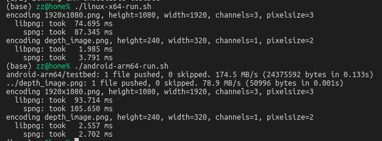

# test_spng_png16

## Intro
This directory serves as the minimal reproduce example for "saving 16 bit grayscale png image with libpng and libspng, compare their performance".

The expected result is libspng's time cost is less than libpng, or nealy same.

The actual result is, libspng is 6~8 times slower than libpng.

## Environment
- OS: 1) Linux x64  2) Android ARM64
- Dependencies
    - libspng: The latest source. With Optimization enabled.
    - libpng: [1.6.38](https://github.com/glennrp/libpng) for performance compare.
    - OpenCV: [4.5.5](https://github.com/opencv/opencv/releases/tag/4.5.5), for utility / helper.


## Time cost compare
### Linux-x64 output
```bash
cd build
./linux-x64-build.sh
./linux-x64-run.sh
```

```
(base) zz@home% ./linux-x64-run.sh 
  libpng: took   2.122 ms
    spng: took  13.385 ms
```

### Android ARM64 output
```bash
cd build
./android-arm64-build.sh
./android-arm64-run.sh
```

```
(base) zz@home% ./android-arm64-build.sh 
  libpng: took   2.189 ms
    spng: took  18.013 ms
```

### Snapshot


## Correct comparison
As Randy pointed out, the previous comparison of libpng and libspng is with different compression settings.

> You are changing the default options for libpng that trades file size for performance but not doing the same with spng:
```c++
if( compression_level >= 0 )
{
    png_set_compression_level( png_ptr, compression_level );
}
else
{
    // tune parameters for speed
    // (see http://wiki.linuxquestions.org/wiki/Libpng)
    png_set_filter(png_ptr, PNG_FILTER_TYPE_BASE, PNG_FILTER_SUB);
    png_set_compression_level(png_ptr, Z_BEST_SPEED);
}
png_set_compression_strategy(png_ptr, compression_strategy);
```

With the [migration guide](https://libspng.org/docs/migrate-libpng/#encoder-configuration) a corresponding compression is added now:
```c++
    //-------------------------
    int compression_level = -1;
    int compression_strategy = IMWRITE_PNG_STRATEGY_RLE; // Default strategy
    //todo: opencv use {} param, should we support it?

    if( compression_level >= 0 )
    {
        //png_set_compression_level( png_ptr, compression_level );
        spng_set_option(ctx, SPNG_IMG_COMPRESSION_LEVEL, compression_level);
    }
    else
    {
        // tune parameters for speed
        // (see http://wiki.linuxquestions.org/wiki/Libpng)
        // png_set_filter(png_ptr, PNG_FILTER_TYPE_BASE, PNG_FILTER_SUB);
        spng_set_option(ctx, SPNG_FILTER_CHOICE, SPNG_FILTER_CHOICE_SUB);
        //png_set_compression_level(png_ptr, Z_BEST_SPEED);
        spng_set_option(ctx, SPNG_IMG_COMPRESSION_LEVEL, Z_BEST_SPEED);
    }
    //png_set_compression_strategy(png_ptr, compression_strategy);
    spng_set_option(ctx, SPNG_IMG_COMPRESSION_STRATEGY, compression_strategy);
    //-------------------------
```

And the time cost on both Linux x64 and Android arm64 are nearly the same:

```
(base) zz@home% ./linux-x64-run.sh  
  libpng: took   1.681 ms
    spng: took   2.118 ms
```
```
(base) zz@home% ./android-arm64-run.sh  
  libpng: took   2.497 ms
    spng: took   2.314 ms
```

