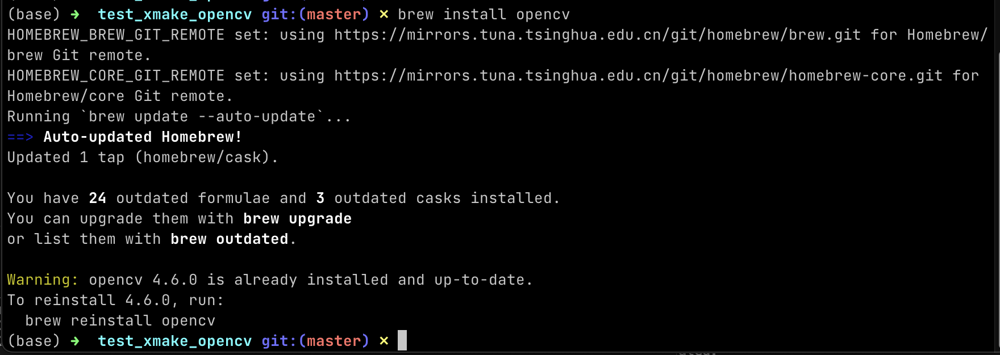
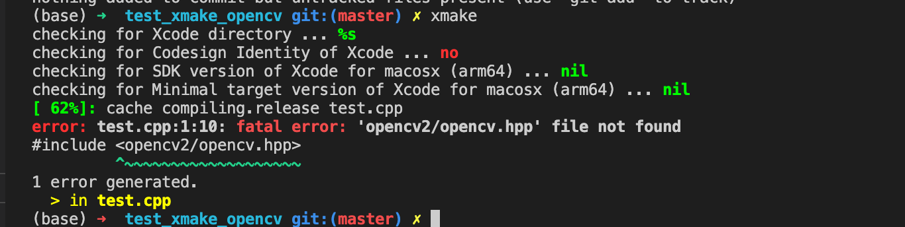

## 说明
用来展示 xmake + homebrew 安装的 opencv 不能使用的问题。

### 系统： Apple M1
```
(base) ➜  test_xmake_opencv git:(master) ✗ uname -a
Darwin zzdeMac-mini.lan 21.5.0 Darwin Kernel Version 21.5.0: Tue Apr 26 21:08:29 PDT 2022; root:xnu-8020.121.3~4/RELEASE_ARM64_T8101 arm64
```
### xmake 版本
v2.7.1
```
(base) ➜  test_xmake_opencv git:(master) ✗ xmake --version
xmake v2.7.1+HEAD.0162040, A cross-platform build utility based on Lua
```

## xmake.lua (不生效)
```lua
add_requires("brew::opencv")

target("test")
    set_kind("binary")
    add_files("test.cpp")
    add_packages("brew::opencv")
```

## brew install opencv
确认用 brew 安装了 opencv



## xmake 命令输出 (报错)


## 预期行为
预期行为是 xmake 命令不报错， 能够让 test.cpp 正确找到 opencv 头文件包含路径。

## xmake.lua (修改，可生效)
`brew::opencv` 改为 `cmake::OpenCV`:

```lua
add_requires("cmake::OpenCV")

target("test")
    set_kind("binary")
    set_languages("cxx11")
    add_files("test.cpp")
    add_packages("cmake::OpenCV")
```